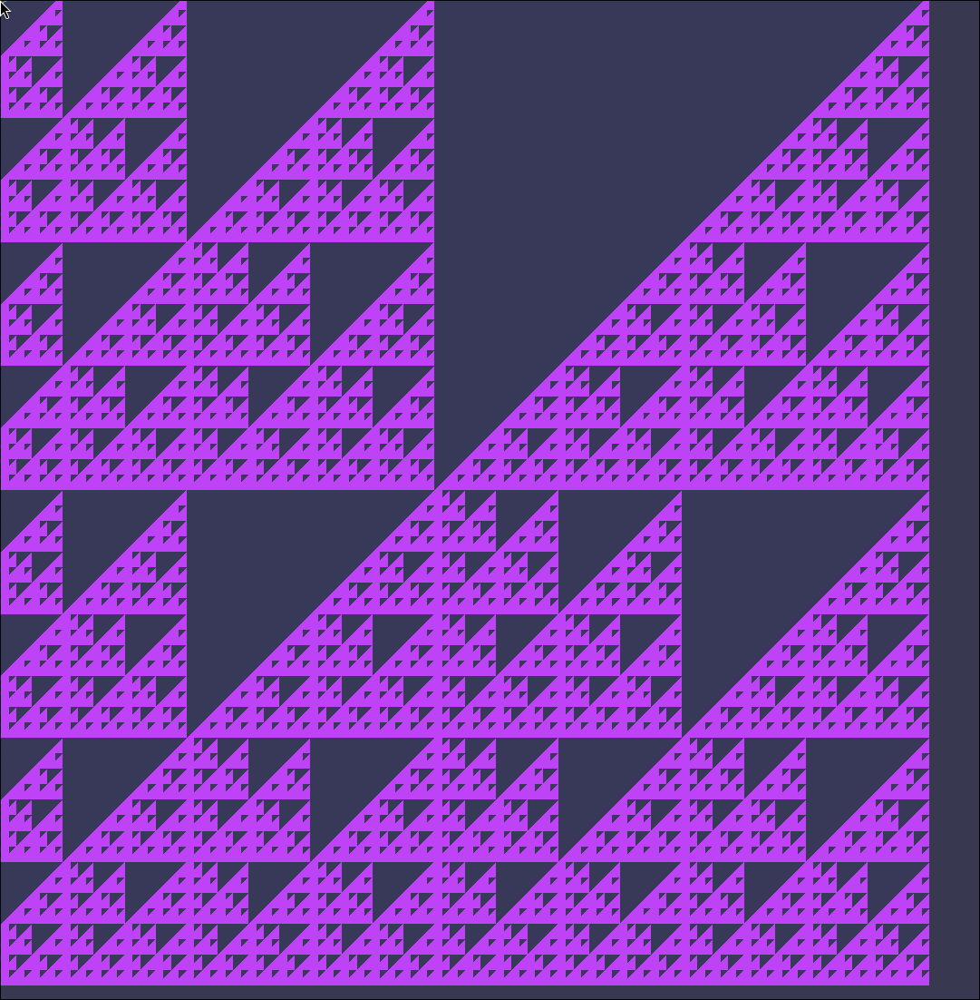

# wgpu_recursion

Generative art using **Rust + wgpu + WGSL shaders**. Recursion lives entirely on
the GPU — no CPU geometry needed.

## What it renders

A **Sierpiński triangle** computed per-pixel in a WGSL fragment shader. Each
pixel tests whether its coordinate is "inside" the fractal by recursively
halving the coordinate space `depth` times. The depth cycles 1 → 8 every 3
seconds so you watch the fractal converge live. A slow pan/zoom animation keeps
it visually alive.



## Run

```bash
cargo run --release
```

## Layout

| File              | Role                                                      |
| ----------------- | --------------------------------------------------------- |
| `src/main.rs`     | Entry point: builds the event loop and runs the app       |
| `src/app.rs`      | Window/input handling and the per-frame depth animation   |
| `src/gpu.rs`      | All wgpu state: surface, device, pipeline, uniform buffer |
| `src/shader.wgsl` | The vertex + fragment shaders where the recursion lives   |

## Key concepts

| Concept                       | Where                                  |
| ----------------------------- | -------------------------------------- |
| Full-screen triangle trick    | `vs_main` in `src/shader.wgsl`         |
| Sierpiński recursion loop     | `in_sierpinski()` in `src/shader.wgsl` |
| Uniform data (time, depth)    | `Uniforms` in `src/gpu.rs`             |
| wgpu surface + pipeline setup | `init_wgpu()` in `src/gpu.rs`          |
| Frame loop + depth cycling    | `about_to_wait()` in `src/app.rs`      |
